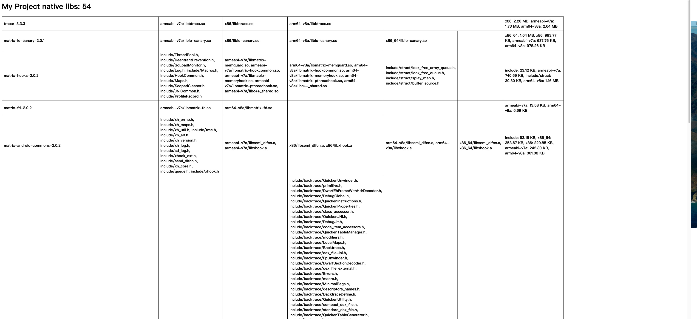
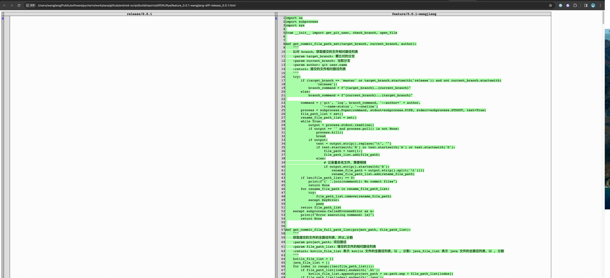
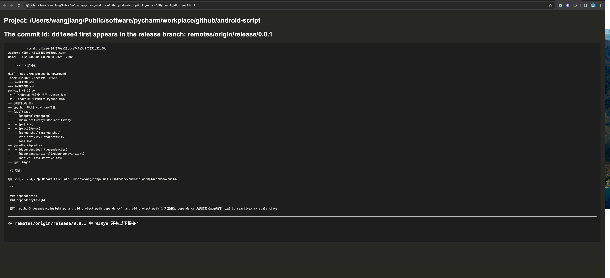

# 在 Android 开发中使用 Python 脚本

- [引言](#引言)
- [python 环境](#python-环境)
- [adb](#adb)
    - [getprop](#getprop)
    - [main activity](#mainacitivity)
    - [pm](#pm)
    - [proc](#proc)
    - [screenshot](#screenshot)
    - [top activity](#topactivity)
    - [wm](#wm)
- [gradle](#gradle)
    - [dependencies](#dependencies)
    - [dependencyInsight](#dependencyinsight)
    - [native libs](#nativelibs)
        - [CI/CD](#CICD)
- [git](#git)
    - [查看某个版本某个作者的所有提交更改](#查看某个版本某个作者的所有提交更改)
    - [查看某个提交第一次出现的 release 版本](#查看某个提交第一次出现的-release-版本)
    - [重复代码检查](#重复代码检查)
    - [增量代码检查](#增量代码检查)

## 引言

在日常的 Android 项目开发中，我们通常会使用 adb 命令来获取连接设备的内存、屏幕、CPU等信息，也会使用 gradle 命令来获取项目构建相关的
projects、tasks、dependencies等信息，还会使用 git 命令来获取代码 commit、log、diff 等信息。这些信息的获取，每次都在command
中输入相关命令进行操作（有时命令记不住，还需要查询一下），重复的操作让人感到厌倦和疲乏。现在，可以尝试使用 python
来简化这一部分工作，将常用的执行命令封装到 python 脚本中，每次想要获取某个信息时，就直接执行相关 python
脚本。这样就可以省去开发中的细碎工作。（将脚本一次写好，使用到退休:)）

## python 环境

Python Version 3.9.6

*执行 `gradle/native_libs.py` 需要安装库 `numpy`*

## adb

在日常的 Android 项目开发中，通常使用 adb 命令来获取屏幕、设备、应用程序等信息。

在 adb 目录下，是用 Python 封装的常用 adb 命令脚本：

- `adb.py`：adb 命令脚本汇总
- `getprop.py`：获取设备的属性信息
- `mainactivity.py`：获取设备三方应用程序的 main activity
- `pm.py`：获取设备上的三方应用程序包名
- `proc.py`： 获取关于系统和进程的信息
- `screenshot.py`：获取截屏文件，并在电脑上打开
- `topactivity.py`：获取设备当前应用程序当前activity
- `wm.py`： 获取设备屏幕信息

### getprop

获取设备的属性信息：

```
python3 getprop.py

输出结果：
//.....省略
[dalvik.vm.dexopt.secondary]: [true]
[dalvik.vm.heapgrowthlimit]: [384m]
[dalvik.vm.heapmaxfree]: [8m]
[dalvik.vm.heapminfree]: [2m]
[dalvik.vm.heapsize]: [512m]
[dalvik.vm.heapstartsize]: [8m]
[dalvik.vm.heaptargetutilization]: [0.75]
//.....省略
[ro.system.build.version.release]: [10]
[ro.system.build.version.sdk]: [29]
//.....省略
[ro.product.vendor.device]: [kirin980]
[ro.product.vendor.manufacturer]: [HUAWEI]
[ro.product.vendor.model]: [kirin980]
[ro.product.vendor.name]: [kirin980]
//.....省略
```

### mainactivity

获取设备三方应用程序的 main activity：

```
python3 mainactivity.py

输出结果：
Package: com.dianping.v1, Main Activity: com.dianping.v1/.NovaMainActivity 
Package: com.tencent.mm, Main Activity: com.tencent.mm/.ui.LauncherUI 
Package: com.baidu.searchbox, Main Activity: com.baidu.searchbox/.SplashActivity 
Package: com.ss.android.article.news, Main Activity: com.ss.android.article.news/.activity.SplashActivity 
Package: com.UCMobile, Main Activity: com.UCMobile/.main.UCMobile 
//.....省略
```

### pm

获取设备上的三方应用程序包名：

```
python3 pm.py

输出结果：
package:com.dianping.v1
package:com.tencent.mm
package:com.baidu.searchbox
package:com.ss.android.article.news
package:com.UCMobile
package:com.huawei.browser.fa
package:com.ss.android.ugc.aweme
package:com.tencent.mobileqq
package:com.netease.newsreader.activity
package:com.suning.mobile.ebuy
//.....省略
```

### proc

获取关于系统和进程的信息：

```
python3 proc.py

输出结果：
系统的版本信息：
Linux version 4.14.116 (HarmonyOS@localhost) (Android (5484270 based on r353983c) clang version 9.0.3 (https://android.googlesource.com/toolchain/clang 745b335211bb9eadfa6aa6301f84715cee4b37c5) (https://android.googlesource.com/toolchain/llvm 60cf23e54e46c807513f7a36d0a7b777920b5881) (based on LLVM 9.0.3svn)) #1 SMP PREEMPT Wed Apr 19 17:33:59 CST 2023

--------------------------------------------------
CPU 信息：
Processor	: AArch64 Processor rev 0 (aarch64)
processor	: 0
BogoMIPS	: 3.84
Features	: fp asimd evtstrm aes pmull sha1 sha2 crc32 atomics fphp asimdhp cpuid asimdrdm lrcpc dcpop asimddp
CPU implementer	: 0x41
CPU architecture: 8
CPU variant	: 0x1
CPU part	: 0xd05
CPU revision	: 0
//.....省略
--------------------------------------------------
内存信息：
MemTotal:        5765848 kB
MemFree:          326496 kB
MemAvailable:     775392 kB
Buffers:            1720 kB
Cached:           740196 kB
//.....省略
--------------------------------------------------
当前运行的进程信息：
Name:	cat
Umask:	0000
State:	R (running)
Tgid:	13681
Ngid:	0
Pid:	13681
PPid:	8617
//.....省略
--------------------------------------------------
文件系统信息：
37 24 253:7 / / ro,relatime shared:1 - erofs /dev/block/dm-7 ro,seclabel,user_xattr,lz4asm
38 37 0:18 / /dev rw,nosuid,relatime shared:2 - tmpfs tmpfs rw,seclabel,size=2850668k,nr_inodes=712667,mode=755
//.....省略
```

如果需要单独获取某一项信息，可以使用：

- 系统的版本信息：`python3 proc.py version`
- CPU 信息：`python3 proc.py cpuinfo`
- 内存信息：`python3 proc.py meminfo`
- 当前运行的进程信息：`python3 proc.py status`
- 文件系统信息：`python3 proc.py mountinfo`

### screenshot

获取截屏文件，并在电脑上打开：

```
python3 screenshot.py

输出结果：
From: /sdcard/Pictures/Screenshots/Screenshot_20240129_120423.png, To: /Users/wangjiang/Desktop/Screenshot_20240129_120423.png
```

这个就不展示具体操作结果了。

### topactivity

获取设备当前应用程序当前activity：

```
python3 topactivity.py

输出结果：
ACTIVITY com.petal.litegames/com.huawei.litegames.LiteGamesActivity 5e73dc2 pid=16955
```

### wm

获取设备屏幕信息：

```
python3 wm.py

输出结果：
Physical size: 1080x2244

Physical density: 480
```

### adb

使用 `python3 adb.py` 是上面脚本的汇总，可以在命令行执行：

- 获取设备的属性信息：`python3 adb.py getprop`
- 获取设备三方应用程序的 main activity：`python3 adb.py mainactivity`
- 获取设备上的三方应用程序包名：`python3 adb.py pm`
- 获取关于系统和进程的信息：`python3 adb.py proc`
- 获取截屏文件，并在电脑上打开：`python3 adb.py screenshot`
- 获取设备当前应用程序当前activity：`python3 adb.py topactivity`
- 获取设备屏幕信息：`python3 adb.py wm`

## gradle

在日常的 Android 项目开发中，通常使用 gradle 命令来获取项目 tasks、projects、dependencies等信息，或执行自定义的 task。

在 gradle 目录下，是用 Python 封装的 gradle 命令脚本：

- dependencies.py：将项目依赖信息保存到文件，并在浏览器中打开
- dependencyinsight.py：将项目中特定依赖项的详细信息保存到文件，并在浏览器中打开
- native_libs.py：与 native_libs.gradle 对应，将项目 so 依赖信息保存到 html 文件，并在浏览器中打开

### dependencies

使用 `python3 dependencies.py android_project_path`，android_project_path 为项目路径：

```
python3 dependencies.py /Users/wangjiang/Public/software/android-workplace/Demo

输出结果：
Report File Path: /Users/wangjiang/Public/software/android-workplace/Demo/build/reports/app-dependencies.txt

```

### dependencyInsight

使用 `python3 dependencyinsight.py android_project_path dependency`，android_project_path 为项目路径，dependency
为需要查找的依赖库，比如 io.reactivex.rxjava3:rxjava：

```
python3 dependencyinsight.py /Users/wangjiang/Public/software/android-workplace/Demo io.reactivex.rxjava3:rxjava

输出结果：
Report File Path: /Users/wangjiang/Public/software/android-workplace/Demo/build/reports/app-dependencyInsight.txt

> Task :app:dependencyInsight
io.reactivex.rxjava3:rxjava:3.0.4
   variant "runtime" [
      org.gradle.status                                               = release (not requested)
      org.gradle.usage                                                = java-runtime
      org.gradle.libraryelements                                      = jar (not requested)
      org.gradle.category                                             = library (not requested)

      Requested attributes not found in the selected variant:
         com.android.build.api.attributes.BuildTypeAttr                  = release
         com.android.build.api.attributes.ProductFlavor:type             = apink
         org.gradle.jvm.environment                                      = android
         com.android.build.api.attributes.AgpVersionAttr                 = 7.2.2
         org.jetbrains.kotlin.platform.type                              = androidJvm
   ]
   Selection reasons:
      - By conflict resolution : between versions 3.0.4, 3.0.0 and 3.0.2

io.reactivex.rxjava3:rxjava:3.0.4
+--- releaseRuntimeClasspath
//......省略
```

### native_libs

将本项目、子项目、三方库依赖的 so 信息输出得到 html 文件，快速找到某个 so 信息。甚至可以在 CI/CD 添加该 python
脚本，方便每个开发人员下载查看。

#### 准备

1. 把文件 `native_libs.gradle` 放到 app 的 `build.gradle` 文件所在同级目录下，并在项目 `build.gradle`
   中添加依赖： `apply from: "./native_libs.gradle"`
2. 执行 `native_libs.py` 需要安装库 `numpy`

注意：在 `native_libs.gradle` 中定义了 so
依赖信息的输出路径：`project.buildDir.path + "/reports/so" + "/native_libs.json"`，确保 `native_libs.py` 中能读到正确的
json 路径。另外，单独在命令行执行 `./gradlew :app:mergeDebugNativeLibs` 任务，此时也会输出 so 信息到 native_libs.json 文件中。

---

使用 `python3 native_libs.py android_project_path`，android_project_path 为项目路径：

```
python3 native_libs.py /Users/wangjiang/Public/software/android-workplace/Demo

输出结果：
Report File Path: /Users/wangjiang/Public/software/android-workplace/Demo/build/report/so/native_libs.html
```



#### CI/CD

在项目 CI/CD build 阶段完成后，在 analyze 阶段新增一个 job: so dependency 用于分析项目依赖的 so 信息，例如：

```yaml
so dependency:
  tags:
    - apk
    - android
  stage: analyze
  script:
    - ./gradlew :app:mergeDebugNativeLibs
  after_script:
    - python3.9 native_lib.py
  artifacts:
    name: "$CI_JOB_STAGE}_reports_${CI_PROJECT_NAME}_$CI_COMMIT_REF_SLUG"
    when: on_success
    expire_in: 3 days
    paths:
      - "*/build/reports"
  only:
    - branches
  except:
    - master
```

在项目每次跑完 pipeline 后，就会生成一个项目 so 依赖信息报告：native_lib.html ，方便每个开发人员下载查看。

## git

在日常的 Android 项目开发中，一般只会使用到： `git add, git commit, git push, git pull, git rebase, git merge, git
diff`等常规命令。但是使用 git 命令，还可以做一些特别的事情，比如查看某个版本某个作者的所有提交更改，方便自己或其他人进行
code
review；比如查看某个提交第一次出现的版本，方便排查问题。

在 git 目录下，是用 Python 封装的 git 命令脚本：

- diff_branch.py：查看某个版本某个作者的所有提交更改
- find_commit.py：某个提交第一次出现的 release 版本
- find_duplicated_code.py：使用 pmd cpd 查找项目重复代码
- increment_detect.py：使用 detekt 和 pmd 做增量代码检查

### 查看某个版本某个作者的所有提交更改

在某个版本迭代中，不管是单人还是多人开发，如果想在 mr 之前 或 之后，或者 release 之前 或
之后，随时查看自己本次版本迭代中的所有提交更改（随时对自己编写的代码进行自我 code review），现只能使用 git 命令：git log
branch1...branch2 --author=wangjiang --name-status --oneline 等进行简单查看，而且较麻烦。我们期望有一个工具，能够展示自己当前分支提交的所有代码更改内容。

使用 `python3 diff_branch.py android_project_path current_branch target_branch`，android_project_path
为项目路径，current_branch 为当前分支，target_branch 为目标分支。适用业务场景：

1. current_branch 为 feature 分支，target_branch 为拉出 current_branch 的主分支，比如：current_branch 为
   feature/7.63.0-wangjiang，target_branch 为 master 或 release/7.62.0，那么此时`diff_branch.py`用于查看自己在
   feature/7.63.0-wangjiang 的提交，也就是该 feature 的提交更改
2. current_branch 为 release/7,63.0 分支，target_branch 为 7.62.0 分支，此时`diff_branch.py`用于查看自己在 release/7.63.0 分支上的提交，也就是自己在
   7.63.0
   版本的所有提交更改

示例：在当前 android-script 项目中，查看自己在 feature 分支 feature/0.0.2-wangjiang 上提交的所有更改（current_branch
为feature/0.0.2-wangjiang，target_branch为release/0.0.1）

```
python3 diff_branch.py /Users/wangjiang/Public/software/python-workplace/android-script feature/0.0.2-wangjiang release/0.0.1

输出结果：
Html Report Path: /Users/wangjiang/Public/software/python-workplace/android-script/build/reports/diff/WJRye/feature_0.0.2-wangjiang-diff-release_0.0.1.html
```



<a href="./build/reports/diff/WJRye/feature_0.0.1-wangjiang-diff-release_0.0.2.html">
feature_0.0.1-wangjiang-diff-release_0.0.2.html 文件报告</a>

*毫无疑问：该`diff_branch.py`脚本适用与任何项目，包括 Android 项目。*

### 查看某个提交第一次出现的 release 版本

在日常的 Android 项目开发中，如果想排查问题，或查看 feature 在哪个版本上线的，那么查看某个 commit 第一次出现的 release
分支，能够辅助你得到更多有用的信息。

示例：在当前 android-script 项目中，查看 commit id : dd1eee4 第一次出现的 release 分支
```
python3 find_commit.py /Users/wangjiang/Public/software/python-workplace/android-script dd1eee4

输出结果：
Html Report Path: /Users/wangjiang/Public/software/python-workplace/android-script/build/reports/diff/commit_id/dd1eee4.html
```


<a href="./build/reports/diff/commit_id/dd1eee4.html"> dd1eee4.html 文件报告</a>

*毫无疑问：该`find_commit.py`脚本适用与任何项目，包括 Android 项目。*

### 重复代码检查


### 增量代码检查
